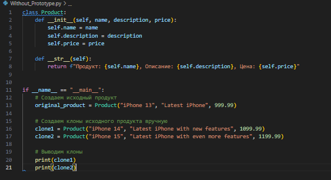

**Паттерн Прототип**

Паттерн **Прототип** - это порождающий паттерн проектирования, который позволяет создавать новые объекты путем копирования существующих экземпляров объектов. Он предоставляет централизованный механизм для создания клонов объектов, не прибегая к прямому вызову их конструкторов.

**Например!**

Создаем разные модели телефонов с их стоимостью и каким то описанием:

Здесь лоны создаются вручную путем создания новых экземпляров класса Product и указания значений для их атрибутов. При изменении структуры класса Product (добавление или удаление атрибутов) необходимо вручную обновить код клонирования.

Суть паттерна Прототип

• Интерфейс клонирования: Определяет интерфейс для клонирования объектов.

• Конкретный прототип: Реализует интерфейс клонирования и предоставляет фактическую реализацию клонирования.

• Клиент: Создает новые объекты путем клонирования прототипов.

Как работает паттерн Прототип:

1\. Клиент выбирает прототип для клонирования.

2\. Прототип создает клон самого себя с помощью метода клонирования.

3\. Клиент получает клон и при необходимости настраивает его.

Преимущества паттерна Прототип:

• Увеличенная производительность: Клонирование объекта обычно быстрее, чем создание нового с нуля.

• Снижение использования памяти: Клоны ссылаются на общие данные, а не создают новые копии, что экономит память.

• Гибкость: Клоны можно легко настроить по мере необходимости, не затрагивая исходные объекты.

Паттерн Прототип полезен в следующих сценариях:

• Когда создание новых объектов обходится дорого (например, с точки зрения времени или ресурсов).

• Когда объекты должны быть настроены на основе существующих объектов с незначительными отличиями.

• Когда требуется поддержка множества вариантов одного и того же объекта.
